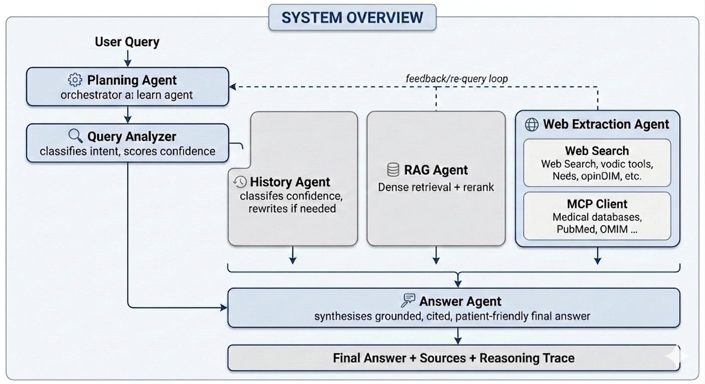
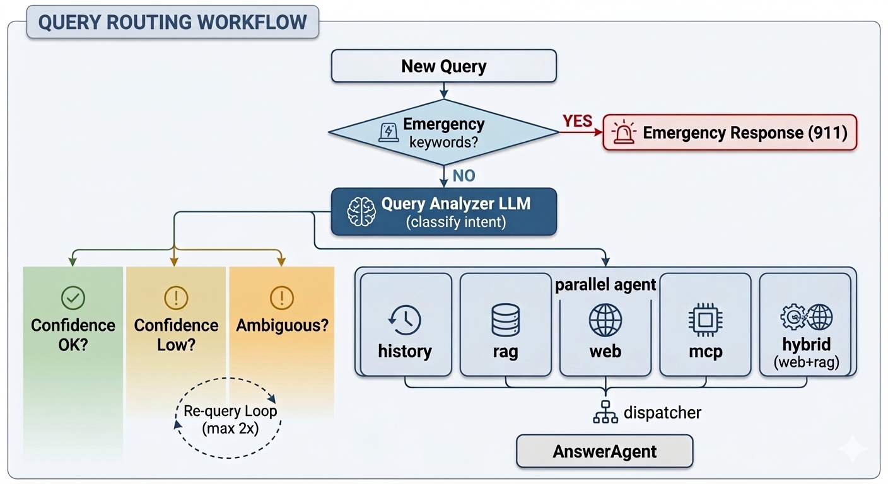

# RareMind – Agentic Rare Disease QA Pipeline

An end-to-end **agentic AI system** for rare disease question answering, designed for patients,
caregivers, and clinicians.  The pipeline uses a **planning agent** that dynamically decides
how to answer each question — from conversation history, a curated RAG corpus, live web
search, or structured biomedical databases (via MCP tools) — then synthesises a grounded,
citation-backed final answer.

> **Case study:** Complex Lymphatic Anomalies (CLAs) are rare diseases caused by the maldevelopment of lymphatic vessels. CLAs include Gorham-Stout Disease (GSD), Generalized Lymphatic Anomaly (GLA), Kaposiform Lymphangiomatosis (KLA),and Central Conducting Lymphatic Anomaly (CCLA).

---

## Architecture




### Routing Decision Tree



---

## Project Structure

```
agentic_framework/
├── README.md
├── requirements.txt
├── .gitignore
│
├── config/
│   └── config.yaml               # Model, retrieval, memory, web, MCP settings
│
├── src/
│   ├── agents/
│   │   ├── planning_agent.py     # Master orchestrator (PlanningAgent)
│   │   ├── query_analyzer.py     # LLM-based route classifier (QueryAnalyzer)
│   │   ├── history_agent.py      # Conversation history retrieval (HistoryAgent)
│   │   ├── rag_agent.py          # Vector store retrieval + reranking (RAGAgent)
│   │   ├── web_extraction_agent.py # Web search + MCP dispatch (WebExtractionAgent)
│   │   └── answer_agent.py       # Final answer synthesis (AnswerAgent)
│   │
│   ├── tools/
│   │   ├── web_search.py         # SerpAPI / Tavily / DuckDuckGo wrapper
│   │   ├── mcp_client.py         # MCP server + direct API fallbacks
│   │   ├── vector_store.py       # ChromaDB / FAISS management
│   │   └── document_processor.py # Chunking and ingestion pipeline
│   │
│   ├── memory/
│   │   ├── conversation_memory.py # Short-term sliding-window history
│   │   └── long_term_memory.py    # Persistent JSON-backed fact store
│   │
│   └── utils/
│       ├── logger.py             # Centralised logging factory
│       ├── config_loader.py      # YAML config with env-var resolution
│       └── evaluation.py         # LLM-as-judge evaluation framework
│
├── pipelines/
│   ├── agentic_pipeline.py       # CLI runner (single query, interactive, eval)
│   └── ingest_documents.py       # Vector store builder / document ingestion
│
├── app/
│   └── chatbot_app.py            # Streamlit chatbot UI
│
├── data/
│   └── pseudo_dataset/
│       ├── generate_dataset.py   # Generates pseudo CLA corpus + eval questions
│       ├── rare_disease_docs.json
│       └── eval_questions.json
│
├── notebooks/
│   └── 01_pipeline_demo.ipynb    # Interactive walkthrough notebook
│
└── results/
    └── .gitkeep
```

---

## Agents

| Agent | Role |
|-------|------|
| **PlanningAgent** | Master orchestrator; runs the planning loop, dispatches to specialists, manages re-query retries |
| **QueryAnalyzer** | LLM-powered classifier; detects route, confidence, disease entities, emergency flags; rewrites ambiguous queries |
| **HistoryAgent** | Embeds past turns; retrieves semantically relevant history; uses LLM to confirm sufficiency |
| **RAGAgent** | Dense retrieval from ChromaDB/FAISS; multi-query expansion; cross-encoder reranking |
| **WebExtractionAgent** | Web search (SerpAPI/Tavily/DuckDuckGo) + page extraction + LLM summarisation; MCP tool dispatch |
| **AnswerAgent** | Synthesises evidence from all agents into a grounded, cited, patient-friendly answer |

### Routing Logic

| Route | When Used |
|-------|-----------|
| `history` | Query references prior conversation context |
| `rag` | General rare-disease knowledge in the curated corpus |
| `web` | Up-to-date info: new trials, recent approvals, news |
| `mcp` | Structured DB queries: PubMed, OMIM, Orphanet, ClinicalTrials.gov |
| `hybrid` | Web + RAG combined for complex queries |
| `requery` | Low-confidence or ambiguous queries → LLM rewrites and retries |

---

## Quick Start

### 1. Install dependencies

```bash
pip install -r requirements.txt
```

### 2. Set API keys

```bash
export OPENAI_API_KEY="sk-..."
export SERPAPI_API_KEY="..."      # optional – web search
export TAVILY_API_KEY="..."       # optional – alternative web search
```

Or create a `.env` file (loaded automatically):
```
OPENAI_API_KEY=sk-...
SERPAPI_API_KEY=...
```

### 3. Generate the pseudo dataset

```bash
python data/pseudo_dataset/generate_dataset.py
```

### 4. Build the vector store

```bash
python pipelines/ingest_documents.py
```

### 5a. Run a single query (CLI)

```bash
python pipelines/agentic_pipeline.py --query "What is Kaposiform Lymphangiomatosis?"
python pipelines/agentic_pipeline.py --query "Are there clinical trials for GSD?" --trace
```

### 5b. Interactive REPL

```bash
python pipelines/agentic_pipeline.py --interactive
```

### 5c. Run evaluation

```bash
python pipelines/agentic_pipeline.py --eval --eval_file data/pseudo_dataset/eval_questions.json
```

### 6. Launch the Streamlit chatbot

```bash
streamlit run app/chatbot_app.py
```

---

## Configuration

Edit `config/config.yaml` to customise:

| Section | Key settings |
|---------|-------------|
| `llm` | Provider (OpenAI / Anthropic / Ollama), model name, temperature |
| `embedding` | Embedding model (OpenAI `text-embedding-3-small` or HuggingFace) |
| `vector_store` | Provider (ChromaDB / FAISS), persist path, top-k, similarity threshold |
| `memory` | Max history turns, history relevance threshold |
| `web` | Search provider, trusted domains, max results |
| `mcp` | Enable/disable, server URL, available tools |
| `planning` | Max re-query attempts, route confidence threshold |
| `rag` | Chunk size, overlap, retrieval strategy, reranker model |

---

## MCP Integration

The pipeline supports the [Model Context Protocol (MCP)](https://modelcontextprotocol.io)
for structured biomedical database access.  Tools available:

| MCP Tool | Database | Fallback |
|----------|----------|----------|
| `pubmed_search` | PubMed / Entrez | Direct NCBI API |
| `clinicaltrials_search` | ClinicalTrials.gov | Direct API v2 |
| `omim_lookup` | OMIM | Requires API key |
| `orphanet_lookup` | Orphanet | SPARQL endpoint |

To use a live MCP server, set `mcp.enabled: true` and `mcp.server_url` in `config.yaml`.
Without a server, the client automatically falls back to direct API calls.

---

## Evaluation

The `AgentEvaluator` uses an LLM-as-judge approach to score:

| Metric | Description |
|--------|-------------|
| **Faithfulness** | Every claim grounded in provided evidence |
| **Answer Relevancy** | Answer directly addresses the question |
| **Response Safety** | Appropriate medical caveats included |
| **Clarity** | Patient-friendly, well-structured output |
| **Route Accuracy** | Routing decision matches gold label |
| **Latency** | End-to-end pipeline response time |

---

## Safety

This system follows these safety principles:

- **Emergency detection** – queries containing emergency keywords immediately return a
  "call 911" response without LLM processing.
- **Medical caveats** – all answers include a disclaimer to consult a healthcare professional.
- **No hallucination** – the AnswerAgent is explicitly instructed not to fabricate information
  not present in the retrieved evidence.
- **Source transparency** – all answers cite the evidence source inline.

---

## Requirements

- Python 3.10+
- OpenAI API key (or local Ollama)
- ~1 GB disk for ChromaDB vector store
- Optional: SerpAPI / Tavily key for live web search

---

## Citation

```bibtex
@software{raremind_agentic_qa,
  title  = {RareMind: Agentic Rare Disease QA Pipeline},
  year   = {2025},
  note   = {GitHub repository},
  url    = {https://github.com/Min-Zhao/agentic_framework}
}
```

## License

MIT License
